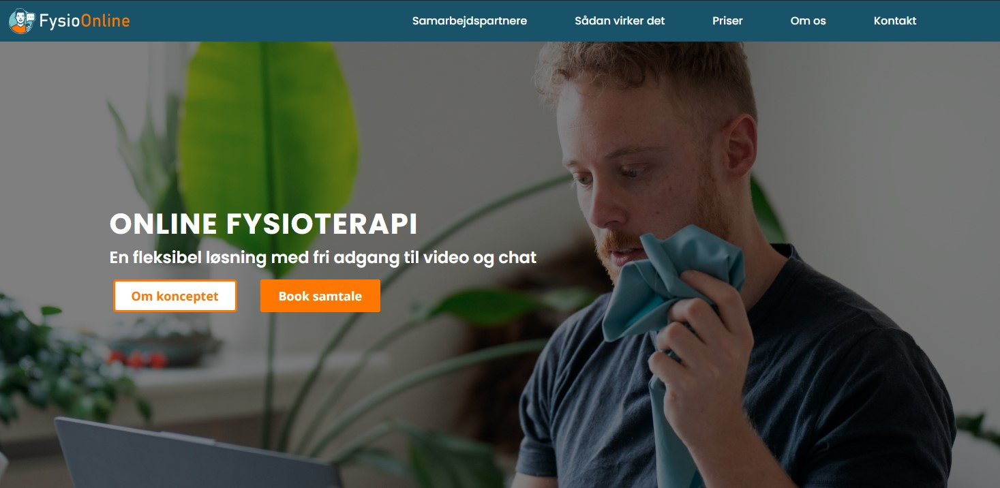
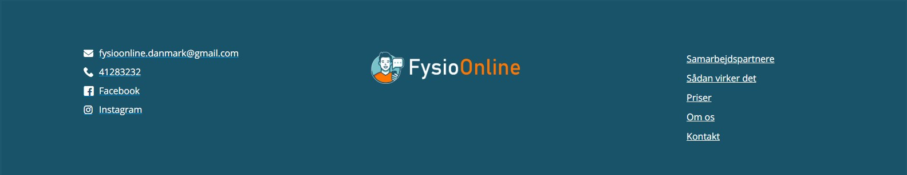
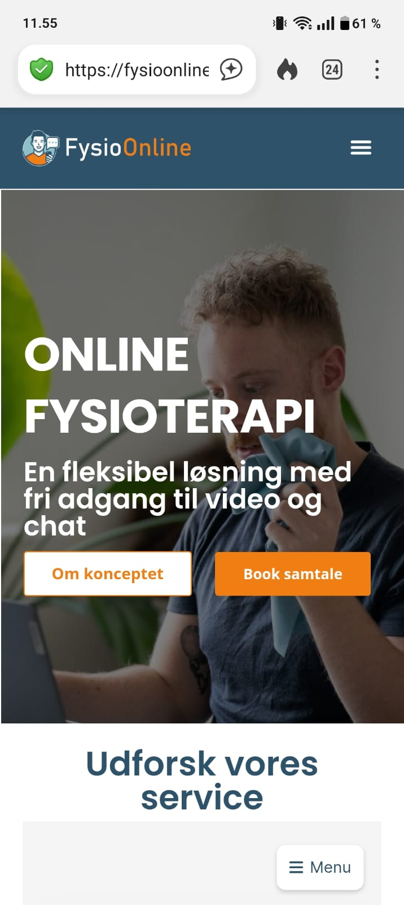
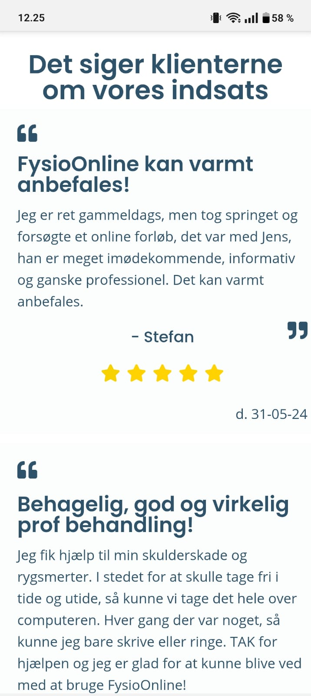
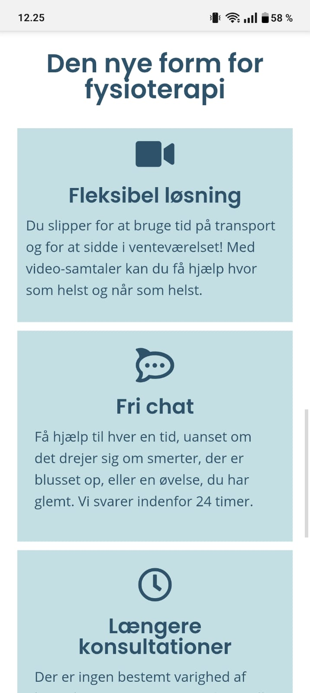
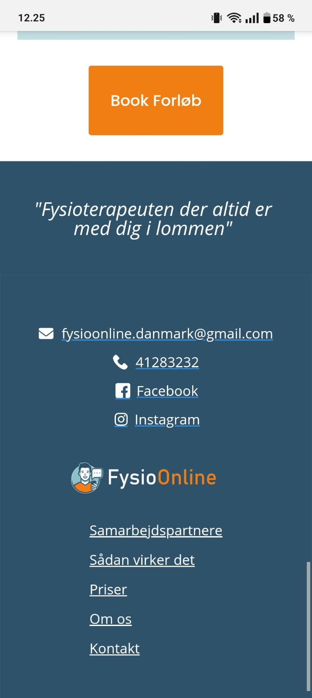
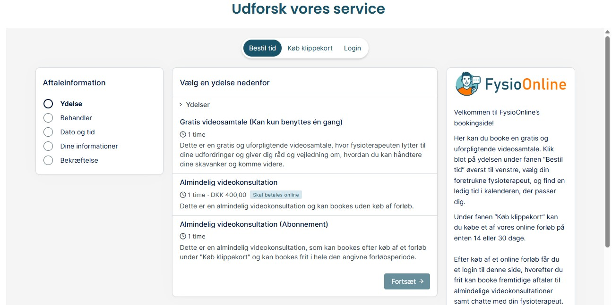
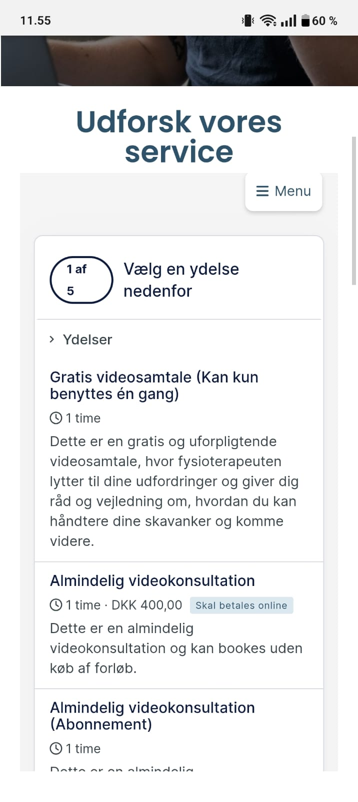
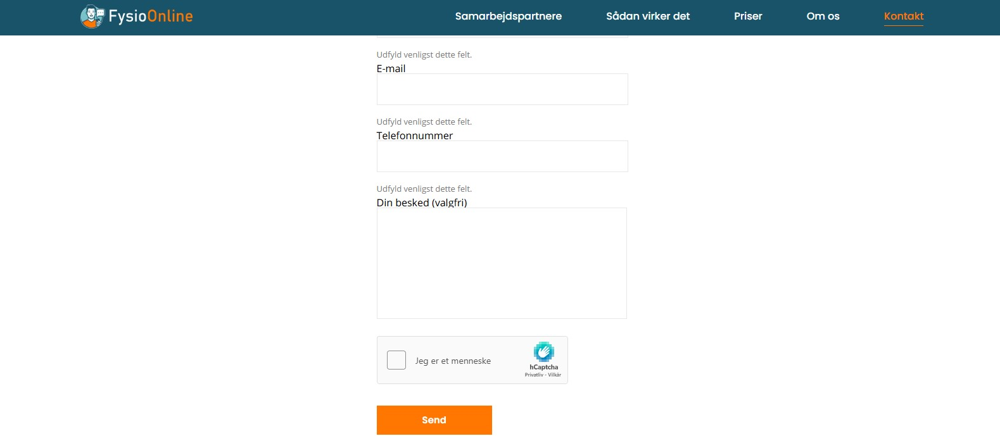
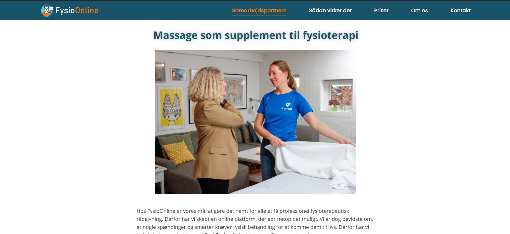

# FysioOnline.dk – Website Enhancements

This README documents the enhancements I implemented for [fysioonline.dk](https://fysioonline.dk/), a physiotherapy clinic website.  
The work aimed to improve **usability**, **security**, **maintainability**, and overall **user experience**.

---

## Overview of Implemented Features

### 1. Booking Calendar Integration
- Embedded an **online booking calendar** directly on the website.
- Allows patients to schedule appointments without phone or email.
- Fully responsive design ensures it works on mobile, tablet, and desktop.

---

### 2. Spam Reduction with CAPTCHA
- Added **Google reCAPTCHA** to forms.
- Reduced spam submissions by over 90%.
- Integrated seamlessly without disrupting the user experience.

---

### 3. Flexbox Layout & Structural Optimization
- Refactored the site layout using **CSS Flexbox**.
- Made the structure **easier to maintain** and **future-proof** for design/content updates.
- Improved code readability for future developers.

---

### 4. Mobile-first Responsiveness
- Applied **mobile-first** design principles.
- Optimized loading and layout for different screen sizes.
- Ensured consistent and accessible UI/UX across devices.

---

### 5. Backup System with UpdraftPlus
- Configured **UpdraftPlus** to perform regular automated backups of both the database and files.
- Backups stored securely with remote storage options enabled.
- Reduced risk of data loss and downtime.

---

### 6. "Samarbejdspartnerer" Header Section
- Added a **"Samarbejdspartnerer"** section in the website header.
- Displayed partner logos and/or information dynamically.
- Improved professional credibility by showcasing partnerships.

---

## Case Study

### Challenges
1. Legacy HTML/CSS structure that made responsiveness difficult.
2. No integrated booking solution.
3. High spam volume via contact forms.
4. No structured backup process.
5. Need to visually promote clinic partnerships.

### Solutions
- **Flexbox refactor** for cleaner, adaptable layout.
- **Booking calendar integration** for seamless scheduling.
- **reCAPTCHA** for spam prevention.
- **Mobile-first approach** for responsive design.
- **UpdraftPlus** configured for automated backups.
- **"Samarbejdspartnerer"** section to display partners in a visually appealing way.

### Results
- Faster booking process for patients.
- Significant spam reduction.
- Fully responsive site structure.
- Data safety via automated backups.
- Increased trust through visible partnerships.

---

##  Screenshots

### Front page (Desktop)

### Front page Section (Mobile)
  
 

### Booking Calendar (Desktop)

### Booking Calendar (Mobile)

### Contact Form with reCAPTCHA

### "Samarbejdspartnerer" Header Section

---

## Technologies Used
- **HTML5 / CSS3** (Flexbox, media queries)
- **JavaScript** (form handling, reCAPTCHA)
- **PWordPress** (Elementor for page building, theme customization)
- **Google reCAPTCHA API**
- **UpdraftPlus** (WordPress backup plugin)

---

## Author
**Matt Nhu Dinh**  
Front-End Consultant & Developer
